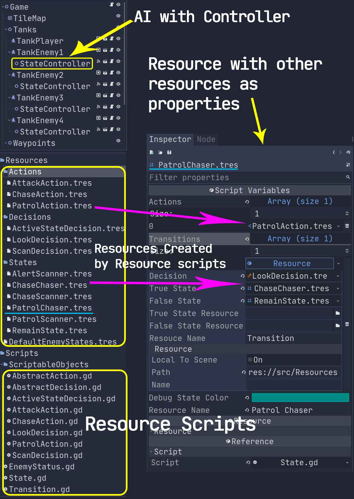
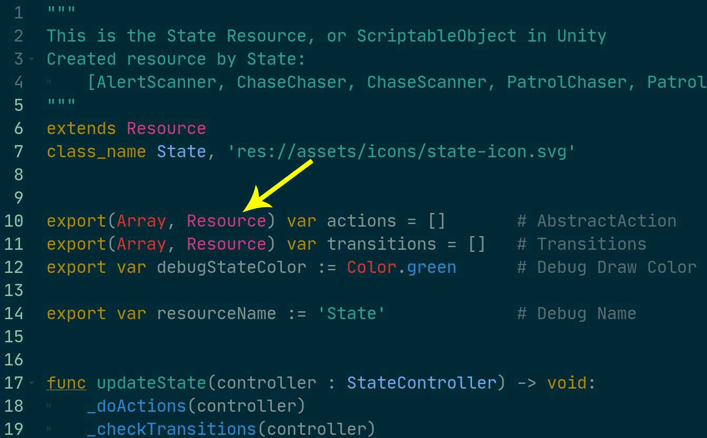

# Try Pluggable AI With Scriptable Objects in Godot

[Godot游戏开发实践之四：搬运Unity的Pluggable AI教程](http://liuqingwen.me/2020/09/08/godot-game-devLog-4-translate-pluggable-AI-tutorial-from-unity-to-godot/)

## About

Several days ago I read a Reddit post: [Unity tutorial --to-> Godot tutorial ?](https://www.reddit.com/r/godot/comments/fo2y2u/unity_tutorial_to_godot_tutorial/) , in the post, the Unity tutorial is all about ScriptableObject and AI, it's so fantastic that I want to try that in Godot! So I made this project.

Reddit post: [https://www.reddit.com/r/godot/comments/fzp0ul/try_pluggable_ai_with_scriptable_objects_in_godot/](https://www.reddit.com/r/godot/comments/fzp0ul/try_pluggable_ai_with_scriptable_objects_in_godot/)

Youtube media: [https://www.youtube.com/watch?v=k8fQTgcHttQ](https://www.youtube.com/watch?v=k8fQTgcHttQ)

Unity Youtube videos: [Unity tutorial - Pluggable AI With Scriptable Objects](https://www.youtube.com/playlist?list=PLX2vGYjWbI0ROSj_B0_eir_VkHrEkd4pi)


I tried, and without any success, but finally, it works, the biggest problem in my project is the **Circular reference to resource** error!
Sometimes all code is right but the start screen just disappears when you start running the game, and **NO ANY INFORMATION** outputs!


## Caution

This game is still very buggy, the code is not well designed, the weird movement of AI Tanks happens sometimes, however, the purpose of this game is not for playing but trying to figure out that: in Godot we can also use "ScriptableObject" to achieve the Pluggable-AI-like effects.

The main error while I tried using "PURE" ScriptableObject or so-called Pluggable pattern is this one:

> "scene/resources/resource_format_text.cpp:1387 - Circular reference to resource being saved found: 'res://src/Resources/States/???.tres' will be null next time it's loaded."

Finally, I used a dirty and hacky way solved this problem: I load these resources(states) in runtime instead of "Drag-n-Drop" settings in the editor.

## Content

This is the main AI content from the Unity tutorial, to make the game more understandable:

- Chase Chaser:
  - Actions: [ChaseAction, AttackAction]
  - Transitions: {Decision: ActiveStateDecision, TrueState: Remain State, FalseState: Patrol Chaser}
- Patrol Chaser:
  - Actions: [PatrolAction]
  - Transitions: {Decision: LookDecision, TrueState: Chase Chaser, FalseState: Remain State}
- Chase Scanner:
  - Actions: [ChaseAction, AttackAction]
  - Transitions: {Decision: LookDecision, TrueState: Remain State, FalseState: Alert Scanner}
- Patrol Scanner:
  - Actions: [PatrolAction]
  - Transitions: {Decision: LookDecision, TrueState: Chase Scanner, FalseState: Remain State}
- Alert Scanner:
  - Actions: []
  - Transitions: [{Decision: ScanDecision, TrueState: Patrol Scanner, FalseState: Remain State}, {Decision: LookDecision, TrueState: Chase Scanner, FalseState: Remain State}]



## Code

IMO, the "ScriptableObject" in Unity is the same thing as "Resource" in Godot, like the "tilesets" created in the TileMap node, so I create the corresponding `Actions/Decisions/States`, etc... in Godot, the resource files is based on the `Resource` subclass scripts.



## Problems

First, a little tricky thing is: you cannot export **Custom Resource Type** in Godot right now, but this is fine, I use `Resource` class instead.

Then, if you want to try with "Pluggable" pattern, and just drag-n-drop the resources into the properties of the states, the **"Circular reference error"** will occur, eventually I find a workaround by using dynamic loading resources with the specified file paths, this is done in the `State` script with `trueStateResource/falseStateResource` parameters added in the code:

```python
func _checkTransitions(controller : StateController) -> void:
    for transition in transitions:
    var decisionSucceeded : bool = transition.decision.decide(controller)
    if decisionSucceeded:
        var trueState = transition.trueState
        if trueState == null:  # loading the resouce
            trueState = load(transition.trueStateResource)
            transition.trueState = trueState
        controller.transitionToState(trueState)
    else:
        var falseState = transition.falseState
        if falseState == null:  # loading the resouce
            falseState = load(transition.falseStateResource)
            transition.falseState = falseState
        controller.transitionToState(falseState)
```

Of course, this is just a demonstration, I just want to explain an idea, and I know that Godot 4.0 will solve the circular reference dependence issue, and, with other great stuff coming together, this is really excited to anticipate, I hope Godot will become much much greater in the future!

- Blog post: [Godot游戏开发实践之四：搬运Unity的Pluggable AI教程](http://liuqingwen.me/2020/09/08/godot-game-devLog-4-translate-pluggable-AI-tutorial-from-unity-to-godot/)
- Reddit Post: [https://www.reddit.com/r/godot/comments/fzp0ul/try_pluggable_ai_with_scriptable_objects_in_godot/](https://www.reddit.com/r/godot/comments/fzp0ul/try_pluggable_ai_with_scriptable_objects_in_godot/)
- Youtube Media: [https://www.youtube.com/watch?v=HujbaVajaJ4](https://www.youtube.com/watch?v=HujbaVajaJ4)
- Github Page: [https://github.com/spkingr/Godot-Pluggable-AI](https://github.com/spkingr/Godot-Pluggable-AI)
